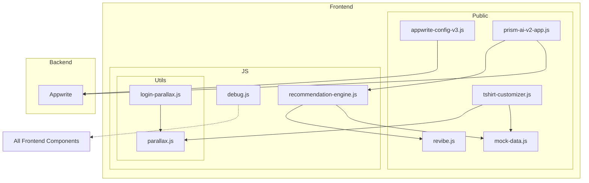

    

    <b>Automatic Architecture Diagrams from Code</b> 
    <a href="https://github.com/swark-io/swark">GitHub</a> • <a href="https://swark.io">Website</a> • <a href="mailto:contact@swark.io">Contact Us</a>

## Usage Instructions

1. **Render the Diagram**: Use the links below to open it in Mermaid Live Editor, or install the [Mermaid Support](https://marketplace.visualstudio.com/items?itemName=bierner.markdown-mermaid) extension.
2. **Recommended Model**: If available for you, use `claude-3.5-sonnet` [language model](vscode://settings/swark.languageModel). It can process more files and generates better diagrams.
3. **Iterate for Best Results**: Language models are non-deterministic. Generate the diagram multiple times and choose the best result.

## Generated Content
**Model**: GPT-4o - [Change Model](vscode://settings/swark.languageModel)  
**Mermaid Live Editor**: [View](https://mermaid.live/view#pako:eNqNVMlugzAQ_RXkc51DcuNQqW3UQ0-V0p6gsoyZgBsvyAtdovx7DS5JCUSNDzDz5j0znhmzR0yXgFKUq8rQpk5e1rlKwrK-iMCj0cqBKiM8Cj37QnB2CnSLNs2H4Q4I02rLK9KusgHCEcLtavFu38YyZoA63gJxdbBKS6RmO1JSR7POwp01VTlbc-MI89Zpyb_BZBHBJ2QqMtDyArL4moYbw60klJN2SULmWe9jynG7xMEfC-br8rQZb3kMvDou7DjWf5IaKgT9zAZjmlW3hK64Ikdy7-LLklFu8eBMSxngUGmtCKig7-rwF8URne5WQuGrrH9eKEFvnA3PPWW7UR53v7MwkUznJsH49ox_1psrGbPnjvTZUC-6PJD_KeNgRdZkQK_ae141dDpyxsMwQ-hbleBFVyIhyHCNs-Ac73TyoGWjFSjXdRTdIAlGUl6G_8E-R64GCTlKkxyVsKVeuBwdAsk3IVVYcxp6LFHqjIcbRL3Tmy_FBt9oX9Uo3VJh4fADvptyEg) | [Edit](https://mermaid.live/edit#pako:eNqNVMlugzAQ_RXkc51DcuNQqW3UQ0-V0p6gsoyZgBsvyAtdovx7DS5JCUSNDzDz5j0znhmzR0yXgFKUq8rQpk5e1rlKwrK-iMCj0cqBKiM8Cj37QnB2CnSLNs2H4Q4I02rLK9KusgHCEcLtavFu38YyZoA63gJxdbBKS6RmO1JSR7POwp01VTlbc-MI89Zpyb_BZBHBJ2QqMtDyArL4moYbw60klJN2SULmWe9jynG7xMEfC-br8rQZb3kMvDou7DjWf5IaKgT9zAZjmlW3hK64Ikdy7-LLklFu8eBMSxngUGmtCKig7-rwF8URne5WQuGrrH9eKEFvnA3PPWW7UR53v7MwkUznJsH49ox_1psrGbPnjvTZUC-6PJD_KeNgRdZkQK_ae141dDpyxsMwQ-hbleBFVyIhyHCNs-Ac73TyoGWjFSjXdRTdIAlGUl6G_8E-R64GCTlKkxyVsKVeuBwdAsk3IVVYcxp6LFHqjIcbRL3Tmy_FBt9oX9Uo3VJh4fADvptyEg)

