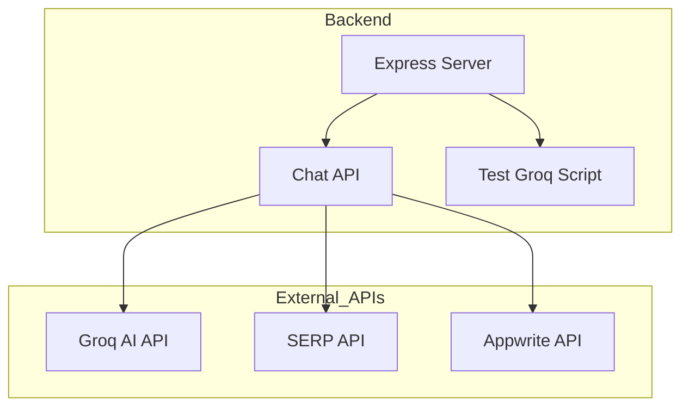

    

    <b>Automatic Architecture Diagrams from Code</b> 
    <a href="https://github.com/swark-io/swark">GitHub</a> • <a href="https://swark.io">Website</a> • <a href="mailto:contact@swark.io">Contact Us</a>

## Usage Instructions

1. **Render the Diagram**: Use the links below to open it in Mermaid Live Editor, or install the [Mermaid Support](https://marketplace.visualstudio.com/items?itemName=bierner.markdown-mermaid) extension.
2. **Recommended Model**: If available for you, use `claude-3.5-sonnet` [language model](vscode://settings/swark.languageModel). It can process more files and generates better diagrams.
3. **Iterate for Best Results**: Language models are non-deterministic. Generate the diagram multiple times and choose the best result.

## Generated Content
**Model**: GPT-4o - [Change Model](vscode://settings/swark.languageModel)  
**Mermaid Live Editor**: [View](https://mermaid.live/view#pako:eNplkcFuwyAMhl8F-dy-QA6TsjWaequW3sI0seA20RLCDLSdqr77IAE1SnzB9mf823CHepAIGXB1JqEbdtxxxbwZ9z0lXkX9g0pO2WAl0gWpKm6a0JgYfj75WyNsfthX4WTemaEjGvtOw28VHBY8VtbUahtrRp2FfnGzSEp0X76VebYKl4PK2CTfL4T8UDrQsvg4LFCu9ZVai1VyZnymP63FttuXtNAqn7aZQKwaSRxuDeJca5CG4Qo20CP1opX-V-4cbIM9csgYB4kn4TrL4eGLnJbC4q4V_pl6yCw53IBwdij_VJ1iGty5gewkOoOPf_EVmQ0) | [Edit](https://mermaid.live/edit#pako:eNplkcFuwyAMhl8F-dy-QA6TsjWaequW3sI0seA20RLCDLSdqr77IAE1SnzB9mf823CHepAIGXB1JqEbdtxxxbwZ9z0lXkX9g0pO2WAl0gWpKm6a0JgYfj75WyNsfthX4WTemaEjGvtOw28VHBY8VtbUahtrRp2FfnGzSEp0X76VebYKl4PK2CTfL4T8UDrQsvg4LFCu9ZVai1VyZnymP63FttuXtNAqn7aZQKwaSRxuDeJca5CG4Qo20CP1opX-V-4cbIM9csgYB4kn4TrL4eGLnJbC4q4V_pl6yCw53IBwdij_VJ1iGty5gewkOoOPf_EVmQ0)

